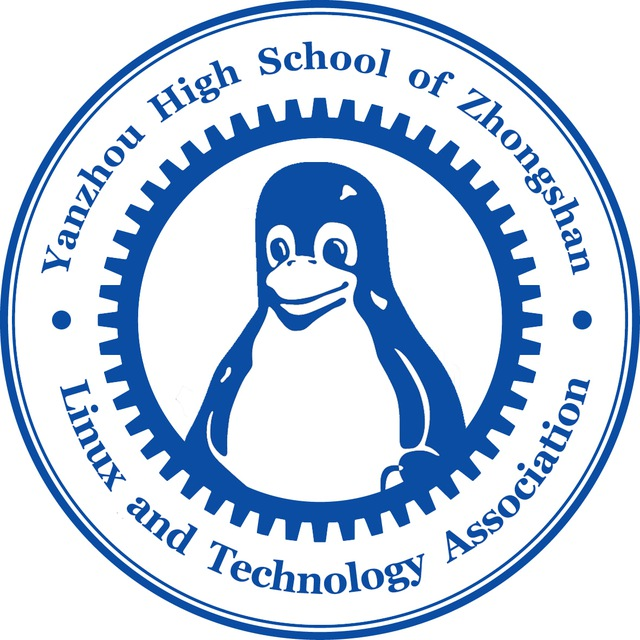

<table style="color: blue; border-collapse: collapse; border: none; background: transparent;">
   <tr>
      <td style="vertical-align: middle; border: none; padding: 0 12px 0 0;">
         <h1 style="margin: 0;">Linux与计算机技术研究会 基本会规</h1>
      </td>
      <td style="vertical-align: middle; text-align: right; border: none; padding: 0;">
         
      </td>
   </tr>
</table>

LTA是一个技术研讨学会，为保证LTA的和谐讨论氛围，我们制定了几条规则，请务必遵守。这些都是最底层的原则，旨在保证LTA最基本的运行。

## 一、保持谦逊原则

知道的越多，就越知道自己不知道的越多。任何成员在分享时，都应意识到技术的广阔无垠，并对他人的提问和不同观点保持开放和尊重的态度。

- 傲慢地嘲讽他人、脚本小子式的炫技都是禁止的。这种行为会被视为违背了本学会的谦逊原则。

## 二、不掉队原则

- 我们不完全禁止娱乐活动。但当你超过 **40%** 的时间都在看视频或打游戏时，我们会认为你“掉队”了。
- “娱乐活动”的范围：

> 打游戏、看无意义的短视频

- 什么不属于“娱乐活动”？

> 看网课。看技术、学术向视频。

我们建议用社团电脑进行游戏签到的成员用时不要超过五分钟。

## 三、安全原则

- 为保证LTA的存续。在会内访问、观看非法内容是绝对禁止的。
- “非法内容”的范围：

> 邪教网站, 色情内容, 政治内容

- 什么不属于非法内容？

> Google、Github、Reddit等虽遭屏蔽但技术学习所必须的网站。

**当一个正式会员违反了社规时，我们主要由会长决定成员的去留。如果其他会员有任何问题，可以向会长和其他负责人提出。**
